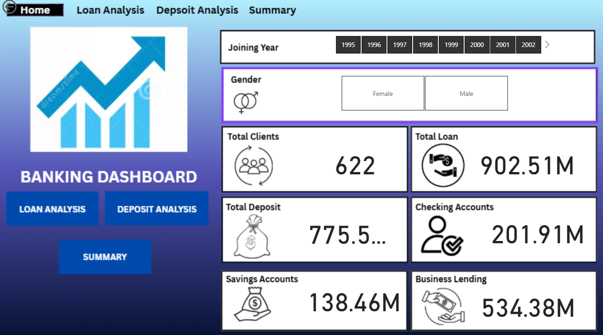
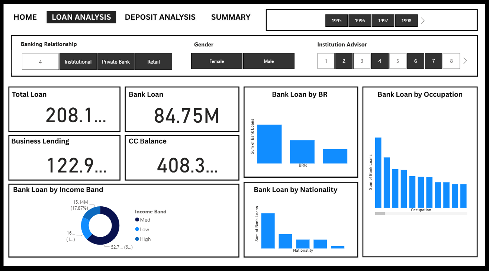
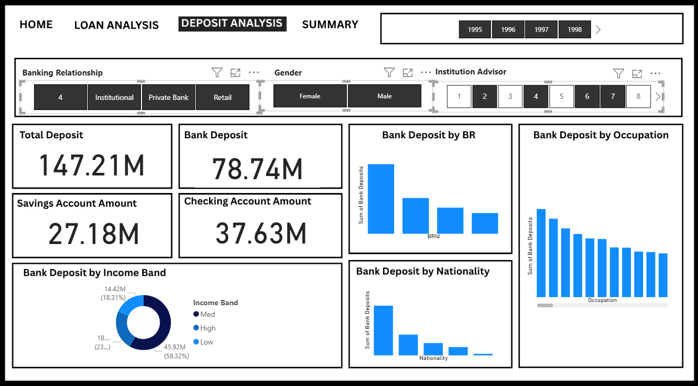
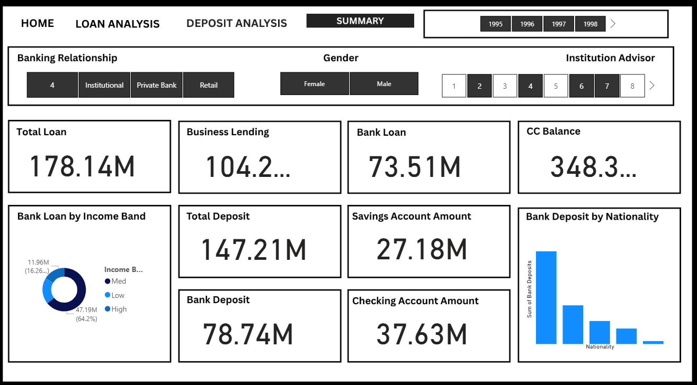

# 📊 Banking Dashboard – Loan & Deposit Analytics

## 1️⃣ PROJECT TITLE / HEADLINE  
### **End-to-End Banking Analytics Dashboard Using Power BI, SQL & Python**

## 2️⃣ DESCRIPTION / PURPOSE  

This project presents a **comprehensive Banking Analytics Dashboard** designed to empower banks and financial institutions with **data-driven insights** into their loan and deposit portfolios.  

Developed using a combination of **Power BI**, **SQL**, **Power Query**, and **Python**, the solution transforms raw transactional data into interactive visuals that highlight key performance metrics, trends, and customer behaviors.  

It aims to solve real-world analytical challenges faced by banks, such as:  
- Understanding the **distribution and performance** of loan portfolios  
- Identifying **top-performing** and **at-risk** customer segments  
- Tracking **savings and checking account** growth over time  
- Providing a **centralized view** for executives to make informed strategic decisions  

This project is ideal for **banking analysts, product managers, financial strategists, and business leaders** seeking to make smarter, data-backed decisions across lending and deposit operations.

## 3️⃣ TECH STACK  

  
  
  
  
  
  
  

**Tools and Technologies Used:**
- **SQL:** For extracting and cleaning banking transaction data  
- **Power Query:** For transforming and preparing datasets  
- **Python (Pandas, NumPy, Matplotlib):** For exploratory data analysis and visualization  
- **Power BI:** For building interactive dashboards and visual reports  

## 4️⃣ DATA SOURCE  

- **Source:** Local dataset (`Banking.csv`)  
- **Format:** CSV  
- **Data Fields Include:**  
  - Customer demographics – *Gender, Income Band, Occupation, Nationality*  
  - Loan information – *Loan Amount, Business Lending, Credit Card Balance*  
  - Deposit details – *Savings, Checking, Total Deposits*  
  - Relationship type and assigned advisor  
  - Transaction year and other key financial metrics  

**Reason for Choosing This Dataset:**  
It closely represents a **real-world banking environment**, containing diverse customer attributes and financial data that enable meaningful loan and deposit analytics.  

## 5️⃣ FEATURES / HIGHLIGHTS  

### **A. Business Problem / Goal**

Banks handle enormous volumes of financial data every day. However, this data often remains underutilized due to fragmentation and lack of clear visualization.  

This dashboard addresses that issue by providing **a single, integrated analytics view** that allows stakeholders to:  
- Identify **high-value customer groups**  
- Analyze **loan performance** by demographics and advisors  
- Understand **deposit patterns** and account trends  
- Detect **potential cross-sell or upsell opportunities**  
- Support strategic decision-making through **real-time KPIs**  

**Goal:**  
To provide a **centralized and interactive system** that simplifies the analysis of loan and deposit portfolios while enabling data-driven business planning.

### **B. Walkthrough of Key Visuals / Modules**

#### ⭐ 1. Home Dashboard  
Provides an at-a-glance overview of the bank’s overall financial health.  

**Key Metrics:**  
- Total Clients  
- Total Loan Amount  
- Total Deposit  
- Breakdown of Savings, Checking, and Business Lending  

**Why It Matters:**  
It gives senior executives a quick summary of key figures and performance indicators in one visual snapshot.

#### ⭐ 2. Loan Analysis Dashboard  
A deep-dive into the performance of various loan categories.  

**Metrics & Visuals Include:**  
- Total Loan Amount  
- Loan Distribution by Income Band  
- Loan Value by Gender, Occupation, and Nationality  
- Advisor/Relationship Manager-wise Loan Breakdown  
- Loan Rank by Value  

**Business Insight:**  
This module identifies the most profitable customer segments and pinpoints underperforming areas or regions requiring strategic intervention.

#### ⭐ 3. Deposit Analysis Dashboard  
Provides insights into customer deposit behavior and trends.  

**Visuals Include:**  
- Total Deposit Value  
- Deposit Type Breakdown (Savings, Checking, Business Accounts)  
- Deposits by Demographic Segments (Gender, Occupation, Nationality)  
- Year-on-Year Deposit Trend  

**Business Insight:**  
Reveals deposit stability, growth patterns, and customer preferences, helping banks improve retention and cross-sell opportunities.

#### ⭐ 4. Summary Dashboard  
An integrated performance report that combines **loan and deposit metrics** into a consolidated dashboard view.  

**Key Uses:**  
- Executive board reviews  
- Quarterly performance reporting  
- Annual business planning and forecasting  

**Business Value:**  
Provides a holistic overview of financial operations and supports proactive decision-making through unified insights.

### **C. Business Insights & Impact**

- Identification of **top-performing customer segments** by income, occupation, and demographics  
- Clarity on **loan vs deposit ratios** for improved portfolio management  
- Enhanced **marketing and lending strategy** through targeted insights  
- Improved understanding of **advisor performance and customer relationships**  
- Data-driven optimization of banking operations and profitability  

This solution effectively transforms raw data into actionable insights that improve **strategic planning, operational efficiency, and customer engagement**.

## 6️⃣ SCREENSHOTS  

### 📌 **Dashboard Previews**

#### 📍 Banking Dashboard Home  
  

#### 📍 Loan Analysis Dashboard  
  

#### 📍 Deposit Analysis Dashboard  
  

#### 📍 Summary Dashboard  
  

## CONCLUSION  

The **End-to-End Banking Analytics Dashboard** serves as a modern analytical solution that bridges the gap between data and decision-making in financial institutions.  
By combining **SQL-based data modeling**, **Python analytics**, and **Power BI visualizations**, it enables stakeholders to:  
- Gain clarity on complex banking datasets  
- Discover actionable insights  
- Drive profitable, customer-centric decisions  
